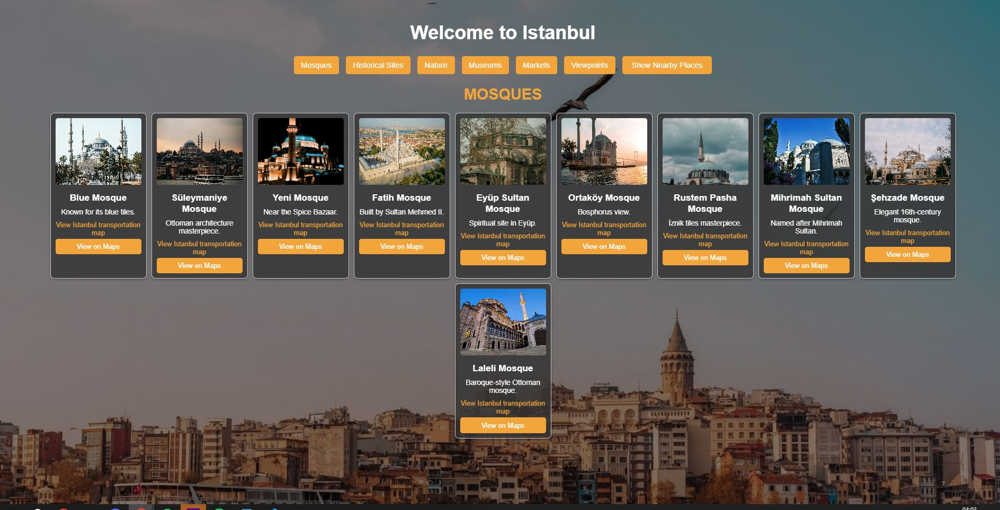

# TuristRota

TuristRota, İstanbul’da turistlerin anlık konumlarını kullanarak en uygun keşif rotalarını sunan interaktif bir harita uygulamasıdır.

## 🚀 Özellikler

- Anlık konum takibi ile kullanıcıya özel rota önerileri  
- İstanbul’daki popüler ve tarihi noktaların listelenmesi  
- Kullanıcı dostu ve mobil uyumlu arayüz  

## 📷 Ekran Görüntüsü

### Ana Sayfa  


## 🔧 Kurulum

Projeyi çalıştırmak için:

```bash
# Proje dizinine girin
cd turistrota

# Gerekli paketleri yükleyin
# (örneğin, backend ise Python ortamı, frontend ise npm)
# Backend için örnek:
python -m venv venv
venv\Scripts\activate  # Mac/Linux için: source venv/bin/activate
pip install -r requirements.txt

# Uygulamayı başlatın
python manage.py runserver

# Frontend için örnek:
cd frontend
npm install
npm run dev
 
Geliştirici
efftta